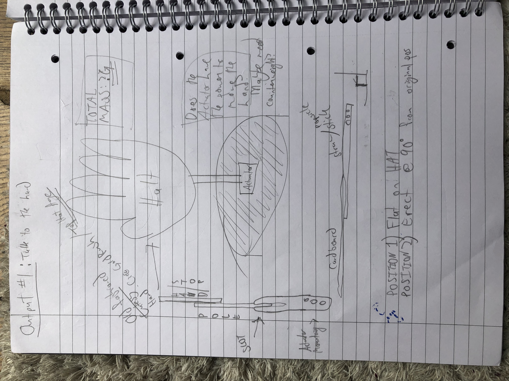
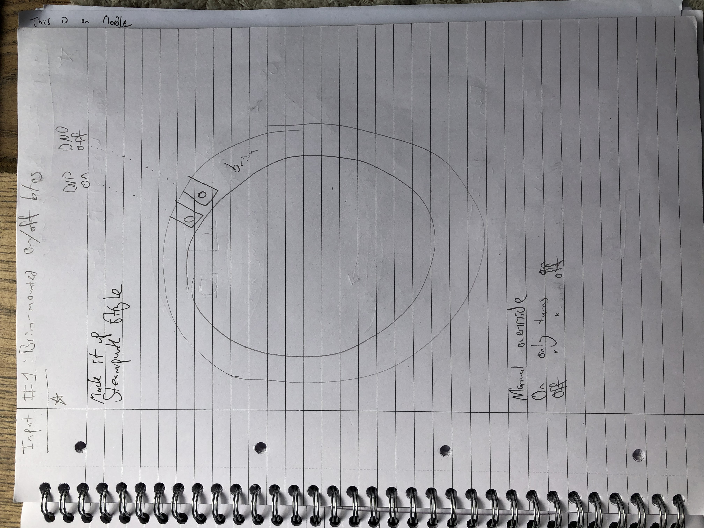
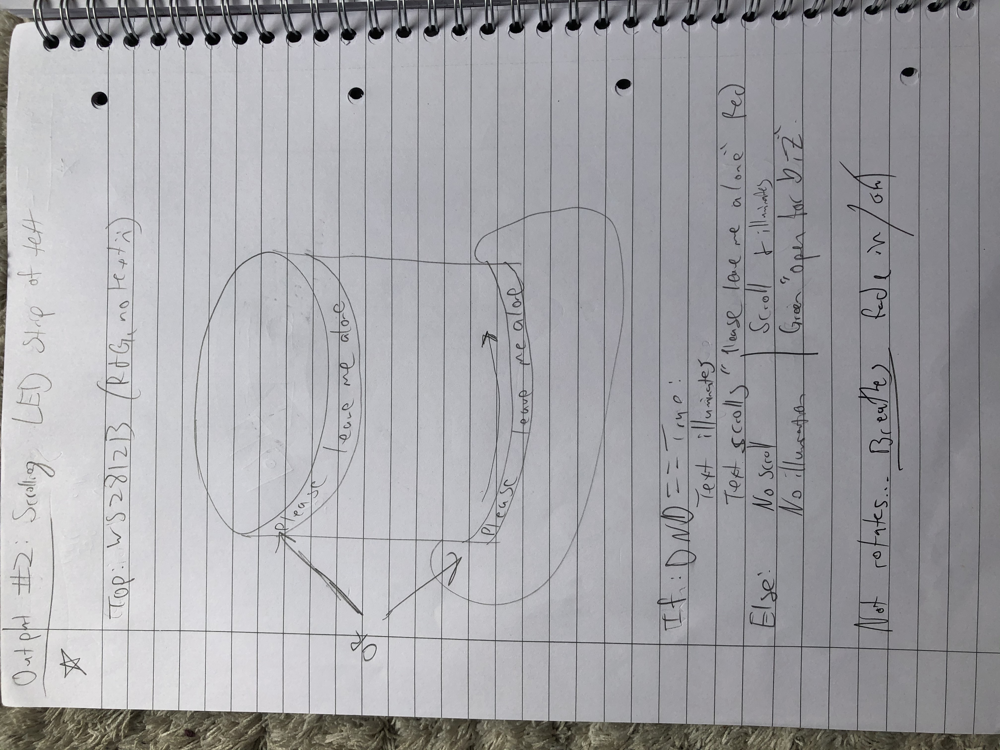
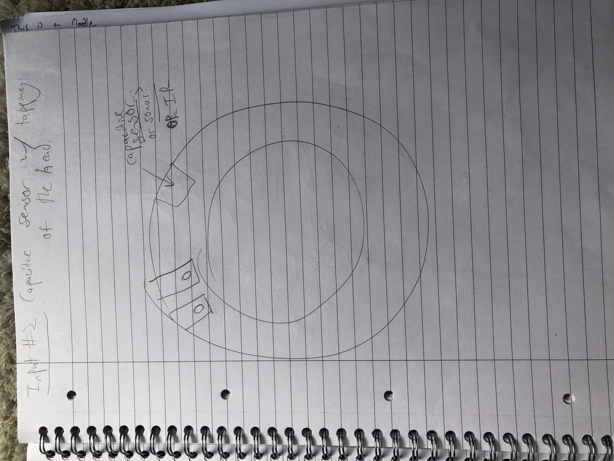
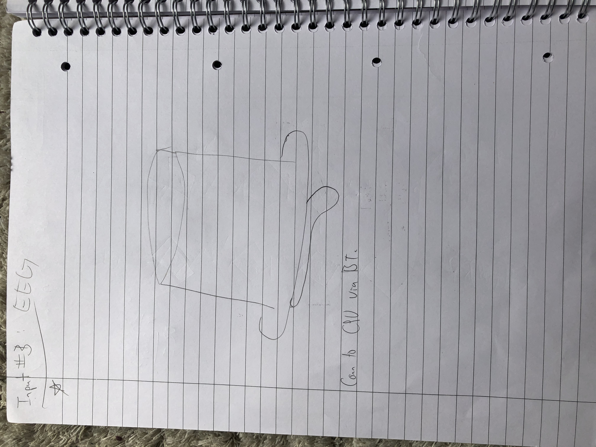
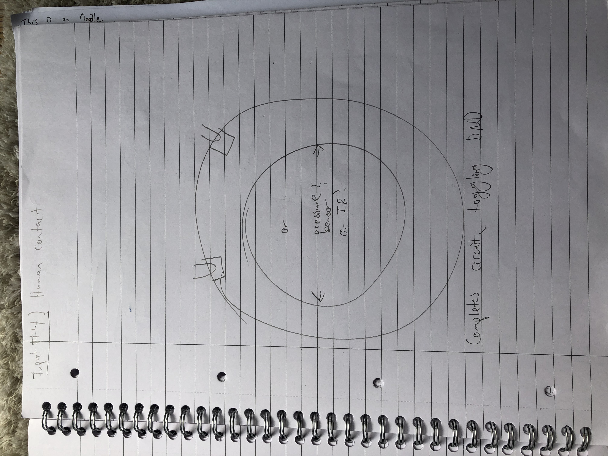
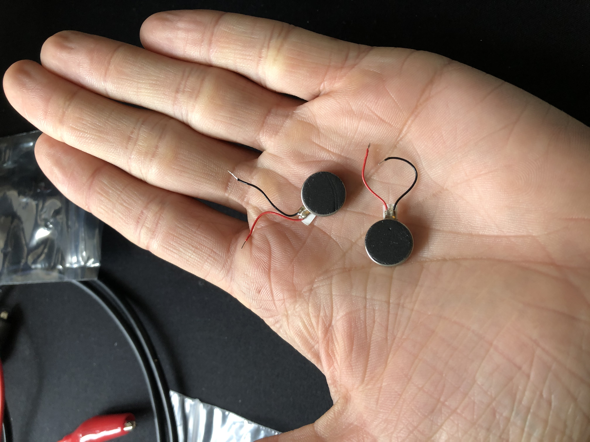
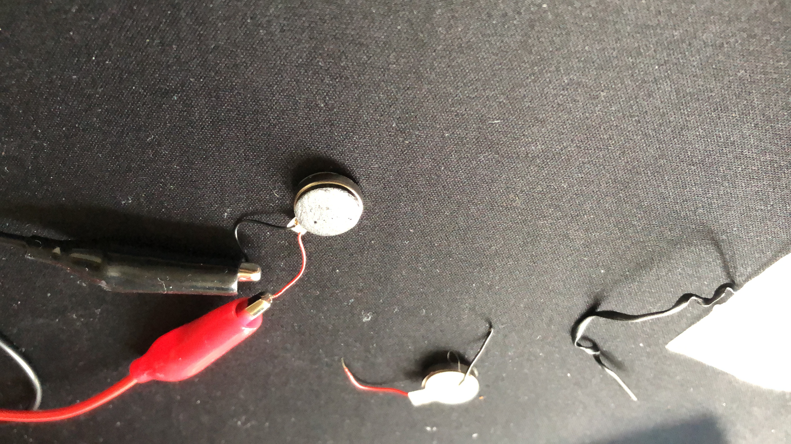
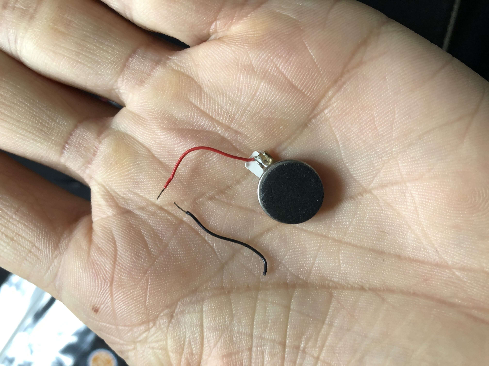

# Physical Computing Final Project Log - Week 1
Msc Creative Computing 2019
Physical Computing 1 w/ Phoenix Perry
By Stuart Leitch

## Background

The "Thinking Cap" is meant to be an attention-preservation device. It is a brain-computer-interface that monitors brain waves, and notes when there are periods of attention on one thing, or this attention changes to something else.

The Thinking Cap is based off of a Muse 2014 headset, at this point. 

## Week 1 (2019/10/28 - 2019/11/3):
### Challenge: Get Arduino and Muse talking to each other.
1. (+) Received the Muse EEG wearable from Sheldon.

2. (+) Charged the Muse and tested it using Muse's iOS app while working on something. There was a 5-minute meditation exercise as introduction to the hardware. Rather than meditate, I did some browsing online. Flipping through tabs and following links. Reviewing the brain wave graph after the conclusion of the 5-minute intro exercise showed I was mainly in the "calm" section which supposedly indicates focus.
3. (-) Attempted to link the Muse with my computer using the open source muse-lsl package. Failed because is only supports the Muse 2016 and later models. This model is in fact a 2014 model. ([muse-lsl GitHub repo](https://github.com/alexandrebarachant/muse-lsl))
4. (-) Muse doesn't support or even provide their SDK anymore, except in special situations. The documentations site is down. Emailed them re: this project.
5. (-) Muse responded and didn't deign to make the SDK available for my research.
6. (+) Nothing on the internet can ever truly disappear. Found the last version of the SDKs from 2015 for Linux and Windows, along with old versions of the documentation.
7. (-) Windows version doesn't work, since it was pre-Windows 10. It will just stop receiving data without throwing an error.

8. (+) Linux SDK version still works. 
9. (-) Arduino won't talk to Linux at all. Sometimes it will connect for a mere moment, but then disappear from the ports.
10. (+) Further testing with the Muse app has shown that while actively having a dialogue with a reading, I tend to have a baseline in the Neutral area. Not Active, not Calm. While doing something more physical and immediate, such as removing a pesky fly from my airspace or going to get a water, it scores me in the Calm region. Good datapoints, if a bit vague since I can't link it to my own data processing yet.

## Week 2 (2019/11/4 - 2019/11/10):
### Challenge: Get Linux to recognize the Arduino, so the Muse and Arduino can pass info. Getting Windows to talk to the Muse seems a more difficult task.
1. (+) Tested with the Muse app further, while doing different activities. Contrary to my expectations, playing Zelda didn't elevate my readings to Active, even when solving puzzles. The game is familiar since I've played through it before, but the puzzle's solution I've since forgotten. This still confuses my hypothesis that Active is the area to watch.
2. (-) Arduino stopped talking to Windows, too. Likely as a result of trying to upload a Sketch via Ubuntu.
3. (+) Thanks to [this thread](https://forum.arduino.cc/index.php?topic=153674.0) I was able to get the Arduino back in action using Windows.
4. (+) Thanks to [this StackExchange Answer](https://arduino.stackexchange.com/questions/61359/avrdude-error-butterfly-programmer-uses-avr-write-page-but-does-not-provide) I was able to chase down a very annoying bug with Ubuntu that prevented serial ports from being properly assigned to the Arduino in Ubuntu.
5. (+) Combined with #4, by changing the programmer to the same as in Windows (Ubuntu has a different default), I was ablt to write a sketch from Ubuntu to Linux. 
6. (+) Both devices talk to Linux. Can proceed with the meat.
7. (+) I started to configure the headset's data transfer protocols. The Muse connects via Bluetooth, which is received by a server running on my machine. The server then streams the data to a charting program, which takes in the 200+ parameters and plots them according to a configuration file. The charting program is buggy since it's old, with plots going off the charts. It's a start.

8. (+) Sketched out how the various inputs/outputs could be mounted on the top hat.

9. (+) Sketched systems diagram for the device. Todo: digitize properly for legibility.

## Week 3 (2019/11/11 - 2019/11/17):
### Challenge: Order components. Get various bits and bobs controlled by the head (Arduino) and tail (Python)
1. (+) Add feature to the hat: Senses when it is being worn.
2. (+) Ordered hat, vibrators, and IR emitters/sensors as well as a 1m LED light strip. Qutie surprised I was unable to source a secondhand top hat after Halloween.
3. (+) Received vibrators and IR emitters/sensors

4. (+) Working with the vibrators, created the beginnings of the communications systems between the Arduino for local control and Python over serial on my machine. 
5. (+) Can control Focus or Non-focused states from either end.

6. (-) Still waiting on hat and LEDs to arrive. 
7. (-) First time connecting a vibrator to the Arduino, it vibrated so hard that it tore its own wiring out. Luckily I bought 3 and only need 2. Still, not ideal to lose the spare so early. Will have to securely mount the wiring and vibrator so that the vibrations are transferred to the hat, and the vibrator doesn't move at all within its mounting.

## Week 3 (2019/11/18 - 2019/11/24):
### Challenge: Make an OSC server receive the output from the Muse headband's attention measurement.
1. (+) Final components the hat and LEDs have arrived. Hat was smashed but "reflated" quite well.
2. (+) Introduced to the Bluefruit BLE device. Plan to use this instead of the Arduino for true wireless.

How-to turn the Thinking Cap on:
1. Turn the Muse on by pressing the Circular on/off button.
2. Start MuseLab with `MuseLab` and load the configuration file `muselab_configuration.json`
    Note: The axis is buggy on the second row at the moment. Will fix that in config file later.
3. Once MuseLab is running, pair it with muse-io on Ubuntu: `muse-io --osc osc.udp://127.0.0.1:5000 --device 00:06:66:67:0B:0C` 
3a. Add --preset 14 if using the preset 14 configuration file (or any other.)